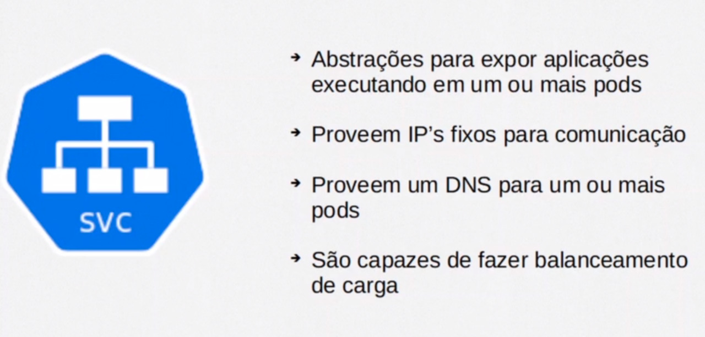

# Componentes do $- <Kubernetes> -$

## Referencia

Curso Alura: https://cursos.alura.com.br/course/kubernetes-pods-services-configmap

Alura Empresas: https://www.alura.com.br/empresas

Alura Planos: https://www.alura.com.br/empresas/planos
