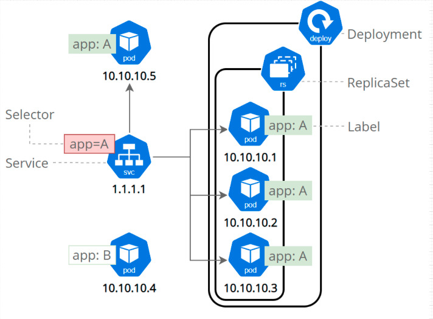

<picture>
  <source media="(prefers-color-scheme: dark)" srcset="./docs/banner.jpeg">
  <source media="(prefers-color-scheme: light)" srcset="./docs/banner.jpeg">
  
</picture>


# PROJETO : poc-kubernetes

Objetivo: implementar uma poc com kubernetes onde seja possivel rodar:

- 2 Aplicações REST Java
- 1 Banco de dados Postgre > PARA - Testes manuais
- 1 Banco de dados Postgre > PARA - Testes integrados
- 

## Como instalar as dependencias

```cmd
    $ sudo npm install
```

## Como criar o cluster

```cmd
    $ npm run deploy
```

## Como deletar o cluster

```cmd
    $ npm run delete
```

## Comandos


```cmd

# Iniciar o cluster

    $ minikube start

* UI 

    $ minikube dashboard

# Cria um pod

    $ kubectl apply -f primeiro-pod.yaml

# Cria tudo

    $ kubectl apply -f . --recursive

# Deleta tudo

    $ kubectl delete pods --all && kubectl delete svc --all

# Comandos de get

    $ kubectl get pods

    $ kubectl get pods --watch

* Mostra os pods com os ips

    $ kubectl get pods -o wide

* Mostra o historico do POC

    $ kubectl describe pod primeiro-pod

    $ kubectl get service

    $ kubectl get nodes -o wide

    $ kubectl get configmap

    $ kubectl describe configmap db-config

# Delete 

    $ kubectl delete -f primeiro-pod.yaml

    $ kubectl delete pods --all

    $ kubectl delete svc --all

    $ kubectl delete pods --all && kubectl delete svc --all && kubectl delete secret --all

# Como entrar dentro do pod

    $ kubectl exec -it portal-noticias -- bash

    $ curl localhost

```

## Arquitetura implemen[Tada]



## Como criar/atualiza o $- <--Cluster--> -$

```cmd

    $ kubectl apply --recursive

```

## Como apagar o $- <--Cluster--> -$

```cmd

    $ kubectl delete pods --all && kubectl delete svc --all

```

## Como atualizar uma imagem

```cmd

docker build . -t luangovinda/db:latest

docker image tag db:latest luangovinda/db:latest

docker push luangovinda/db:latest

docker pull luangovinda/db:latest

```

## Como executar uma imagem container

docker run -it luangovinda/db:latest

## Como entrar dentro do POD

kubectl exec -it postgres-5cfb879499-ggmtd -- bash

## Referencia

Curso Alura: https://cursos.alura.com.br/course/kubernetes-pods-services-configmap

Componentes Kubernetes: [Componentes Kubernetes](./README--Componentes_Kubernetes--.md)

Repo exemplo: https://github.com/ryderdamen/postgres_in_kubernetes
